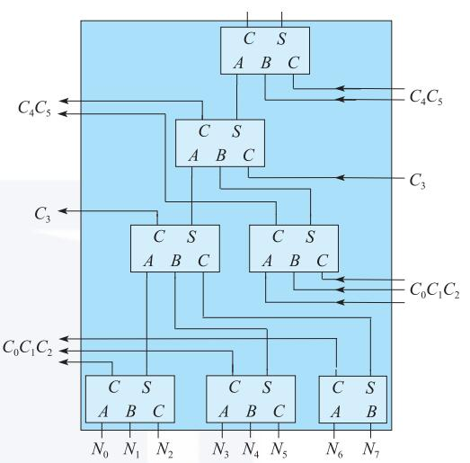

# week 3 多路复选器；加、乘法器

> 在学习本周课程之前，你需要
>
> - [ ] 学会verilog基本运算符
>
>   [Verilog HDL——运算符_verilog逻辑运算符_~Old的博客-CSDN博客](https://blog.csdn.net/qq_43460068/article/details/122001173)
>
>   [Verilog语法之四：运算符 - 知乎 (zhihu.com)](https://zhuanlan.zhihu.com/p/72014513?ivk_sa=1024320u&utm_id=0)
>
> - [ ] 学会tb文件写法
>
>   [Verilog 基础仿真文件编写_verilog仿真程序编写_背影疾风的博客-CSDN博客](https://blog.csdn.net/weixin_54358182/article/details/129495887)
>
> - [ ] 学会补码及其加减法
>
>   [原码-反码-补码 --数学公式分析_原码反码补码计算公式及关系-CSDN博客](https://blog.csdn.net/qq_34771697/article/details/77972501)
>
>   [【原创】计算机为什么要用补码？ - 知乎 (zhihu.com)](https://zhuanlan.zhihu.com/p/105917577)
>
>   [【计算机组成原理】补码的加减运算方法_补码相加怎么算的-CSDN博客](https://blog.csdn.net/qq_43511405/article/details/105898286)
>
> - [ ] 

## 多路复选器

作用：从一组输入数据中选出某一个来


核心：用与门当做开关，通过数据信号和控制信号相与实现各数据的选择效果

### 二选一

电路图：

verilog实现方式：

- 门级电路（了解即可）

```verilog
module mux2_gate (
    input wire [7:0]a,b,
	input wire sel,
    output wire [7:0]y
);
    assign y = (a & {8{sel}}) | (b & {8{~sel}});
endmodule
```

- 行为级描述

```verilog
module mux2 (
	input wire[7:0] a,b,
	input wire sel,
	output wire[7:0] y
    );
		
	assign y = sel ? a : b;
endmodule //1=>a,0=>b
```

- 带参数的常用写法

```verilog
module mux2_par #(
	parameter n=8
) (
	input wire[n-1:0] a,b,
	input wire sel,
	output wire[n-1:0] y	
);
	assign y = sel ? a : b;
endmodule
```

​		调用方式

``` verilog
mux2_par #(.n()) u_mux2_par (.a(),.b(),.sel(),.y());
```

### 四选一

电路图：

verilog实现方式：

- 门级电路（了解即可）

``` verilog
module mux4_gate (
	input wire [7:0]a,b,c,d,
	input wire [1:0]sel,
	output wire y
);
    assign y=(a&&~sel[0]&&~sel[1])|(b&&sel[0]&&~sel[1])|(c&&~sel[0]&&sel[1])|(d&&sel[0]&&sel[1]);
endmodule//00=>a,01=>b,10=>c,11=>d
```

- 行为级描述

```verilog
module mux4 (
	input  wire[7:0] a,b,c,d,
	input  wire[1:0] sel,
	output wire[7:0] y
    );
	
	assign y = sel[0] ? (sel[1] ? d : c) : (sel[1] ? b : a);
endmodule//00=>a,01=>b,10=>c,11=>d
```

- 带参数的常用写法

``` verilog
module mux4_par #(
	parameter n=8
) (
    input  wire[n-1:0] a,b,c,d,
	input  wire[1:0] sel,
    output wire[n-1:0] y
    );
	
	assign y = sel[0] ? (sel[1] ? d : c) : (sel[1] ? b : a);
endmodule//00=>a,01=>b,10=>c,11=>d
```

​		调用方式

``` verilog
mux4_par #(.n()) u_mux4_par (.a(),.b(),.c(),.d(),.sel(),.y());
```


> 本章你需要学会的
>
> - [ ] 带参数的写法及其调用方法


## 加法器

### 半加器

只将两个1位二进制数相加，不考虑低位进位。

- 真值表

<table border="4" >
	<tr align =center>
		<td colspan="2">输入</td>
        <td colspan="2">输出</td>
	</tr>
	<tr align =center>
		<td>A</td>
		<td>B</td>
        <td>S</td>
        <td>CO</td>
	</tr>
    <tr align =center>
        <td>0</td>
		<td>0</td>
        <td>0</td>
        <td>0</td>
    </tr>
    <tr align =center>
        <td>0</td>
		<td>1</td>
        <td>1</td>
        <td>0</td>
    </tr>
    <tr align =center>
        <td>1</td>
		<td>0</td>
        <td>1</td>
        <td>0</td>
    </tr>
    <tr align =center>
        <td>1</td>
		<td>1</td>
        <td>0</td>
        <td>1</td>
    </tr>
</table>
- 逻辑函数

$$
S=\overline{A}B+A\overline{B}=A\oplus B\\
CO=AB
$$
- 电路图


- verilog实现方式

```verilog
module half_adder (
    input  a,b,
    output s
);

assign s = a ^ b;
endmodule
```

### 全加器

除了要将两个1位二进制数相加外，还有考虑来自低位的进位。

- 真值表

<table border="5" >
	<tr align =center>
		<td colspan="3">输入</td>
        <td colspan="2">输出</td>
	</tr>
	<tr align =center>
        <td>CI</td>
		<td>A</td>
		<td>B</td>
        <td>S</td>
        <td>CO</td>
	</tr>
    <tr align =center>
        <td>0</td>
        <td>0</td>
		<td>0</td>
        <td>0</td>
        <td>0</td>
    </tr>
    <tr align =center>
        <td>0</td>
        <td>0</td>
		<td>1</td>
        <td>1</td>
        <td>0</td>
    </tr>
    <tr align =center>
        <td>0</td>
        <td>1</td>
		<td>0</td>
        <td>1</td>
        <td>0</td>
    </tr>
    <tr align =center>
        <td>0</td>
        <td>1</td>
		<td>1</td>
        <td>0</td>
        <td>1</td>
    </tr>
    <tr align =center>
        <td>1</td>
        <td>0</td>
		<td>0</td>
        <td>1</td>
        <td>0</td>
    </tr>
    <tr align =center>
        <td>1</td>
        <td>0</td>
		<td>1</td>
        <td>0</td>
        <td>1</td>
    </tr>
    <tr align =center>
        <td>1</td>
        <td>1</td>
		<td>0</td>
        <td>0</td>
        <td>1</td>
    </tr>
    <tr align =center>
        <td>1</td>
        <td>1</td>
		<td>1</td>
        <td>1</td>
        <td>1</td>
    </tr>
</table>

- ~~逻辑函数~~ 可以通过两个半加器串联修改实现

$$
S=A\oplus B\oplus CI\\
CO=AB+\left( A+B\right) \left( CI\right)
$$


- 电路图


- verilog实现方式

```verilog
module adder_1bit (
    input a,b,ci,
    output s,co
);

assign s = a^b^ci;
assign co = (a&b)|(ci&(a^b));
endmodule
```

### 多位加法器

#### 行波进位加法器（Ripple-carry adder）

- 示意图


如同波一般向前计算。每次运算需要等待前一位的进位值，由全加器的电路图可知，从cin到cout有两级门电路的时延，所以对于N位行波进位加法器，时延就是$3+(N-1)*2=2N+1$级。可见，在位数更高的RCA中，串行计算带来的时延会相当大，这对于现代高速运算是不可忍受的。

- verilog实现方式

```verilog
module adder_8bit (
    input  [7:0] a,b,
    input        ci,
    output [7:0] s,
    output       co
);

wire [8:0] temp_co;

assign temp_co[0] = ci;

generate
    genvar i;
    for (i = 0;i<8 ;i=i+1 ) begin:adder_simple
        adder_1bit adder_unit(.a(a[i]),.b(b[i]),.ci(temp_co[i]),.s(s[i]),.co(temp_co[i+1]));
    end
endgenerate

assign co=temp_co[8];
endmodule
```

#### 超前进位加法器（Carry-lookahead Adder）

为了提高运算速度，必须设法减小或消除由于进位信号逐级传递所耗费的时间，于是设计出超前进位加法器。

##### 超前进位逻辑


两个多位数中第*i*位相加产生的进位输出$(CO)_i$可表示为
$$
(CO)_i=A_iB_i+\left( A_i+B_i\right) \left( CI\right)_i
$$
我们将$G_i = A_iB_i$称为进位生成函数，将$P_i = (A_i+B_i)(CI)_i$称为进位传递函数。

通过数学计算展开可得
$$
\left( CO\right) _{i}=G_{i}+P_{i}G_{i-1}+P_{i}P_{i-1}G_{i-2}+\ldots +P_{i}P_{i-1}\ldots P_{1}G_{0}
+P_{i}P_{i-1}\ldots P_{0}G_{0}
$$
于是我们得到了任意一位产生的进位，避免了等待进位信号的逐级传递，将实现上述逻辑的电路称为**CLU**（Carry Lookahead Unit）。由公式可以看出，并行生成各级$C_i$的时延来自$G_i$和$P_i$的先与后或，再加上生成$G_i$和$P_i$的一级门电路，总共是三级门电路时延。而且可以看出，时延的级数并不会随位数的增加而增加，不论多少位CLA，生成各级$C_i$的时延恒为三级门电路。


由全加器的真值表可得第$i$位和$S_i$的逻辑式
$$
S_i=A_i\oplus B_i\oplus (CI)_i \ \ \ 或 \ \ \ S_i= \sim G_i P_i\oplus (CI)_i
$$
同样不超过三级门电路


##### 4位超前进位加法器

```verilog
module CLA4 (
    input [3:0]a,b,
    input ci,
    output [3:0]s,
    output co
);

wire [3:0]G,P;
wire [3:0]co_buf,ci_buf;

generate
    genvar i;
    for (i = 0;i<4 ;i=i+1 ) begin
       assign G[i] = a[i] & b[i];
       assign P[i] = a[i] | b[i];
    end
endgenerate

assign co_buf[0]=G[0] | G[0]&ci;
assign co_buf[1]=G[1] | P[1]&G[0] | P[1]&P[0]&ci;
assign co_buf[2]=G[2] | P[2]&G[1] | P[2]&P[1]&G[0] | P[2]&P[1]&P[0]&ci;
assign co_buf[3]=G[3] | P[3]&G[2] | P[3]&P[2]&G[1] | P[3]&P[2]&P[1]&G[0] | P[3]&P[2]&P[1]&P[0]&ci;
assign co = co_buf[3];
            
assign ci_buf = {co_buf[2:0],1'b0};

generate
	genvar i;
	for (i = 0;i<4 ;i=i+1) begin
		assign s[i] = ~G[0] & P[i] ^ ci_buf[i];
	end
endgenerate
    
endmodule
```

##### 更多位超前进位加法器

在设计出4位超前进位加法器后，一个很自然的想法是：要想得到更多位CLA，只需像4位CLA那样，只是多递归几次的区别。这个方法叫**全超前进位**。全超前进位理论上是可行的，但由CLU的公式可知，随着位数的增加，实现CLU的门电路数量会急剧增加，导致电路面积开销过大；另一方面，位数的增加也会使扇入飞速增大，导致时延增加。

**所以，单纯的递归并不是好的解决方案。**

一个解决方案是借鉴RCA。将多个4位CLA级联，即采用“组内超前进位，组间串行进位“来构成更多位超前进位加法器。其中每个4位CLA从进位输入到进位输出是两级门电路时延，加上第一级CLA的PG时延和最后一级CLA的异或门时延，这种方式构成的N位超前进位加法器的总时延为$1+2*(N/4)+1=N/2+2$。

如果想获得更快的速度，就得采用另一种方法——**多级超前进位加法器**。多级超前进位加法器采用“组内超前进位，组间也超前进位”的方式，可进一步降低因组间串联进位带来的时延。即将每个4位CLA看做一位再由超前进位逻辑再次进行超前进位，故称为多级超前进位加法器。

> 本章你要学会的
>
> - [ ] 超前进位加法器是怎么优化降低时延的
> - [ ] generate-for循环调用模块
>
> 一些可参考资料
>
> 《数字电子技术基础》阎石 p172-176
>
> 《计算机体系结构基础》胡伟武 p188-193
>
> [32位超前进位加法器的设计-T-Tang-电子技术应用-AET-中国科技核心期刊-最丰富的电子设计资源平台 (chinaaet.com)](http://blog.chinaaet.com/T_Tang/p/5100051382)
>
> [16位两级超前进位加法器的Verilog实现及时延分析 - 知乎 (zhihu.com)](https://zhuanlan.zhihu.com/p/579055858?utm_id=0)

## 乘法器

不采用任何优化算法的乘法过程，可以用我们小学就学过的列竖式乘法来说明。从乘数的低位开始，每次取一位与被乘数相乘，其乘积作为部分积暂存，乘数的全部有效位都乘完后，再将所有部分积根据对应乘数数位的权值错位累加，得到最后的乘积。


这样原始的乘法在设计上是可以实现的，但在工程应用上几乎不会采用，在时延与面积上都需要优化。一个N位的乘法运算，需要产生N个部分积，并对它们进行全加处理，位宽越大，部分积个数越多，需要的加法器也越多，加法器延时也越大，那么针对乘法运算的优化，主要也就集中在两个方面：**一是减少加法器带来的延时，二是减少部分积的个数**。

### 补码移位乘法器

首先解决负数乘法问题。在加减法中我们采用补码解决负数和减法问题，在负数乘法中同样可以使用补码。

假定有 8 位定点数 $Y$， $[Y]_补$  的二进制格式写作 $y_7 y_6 y_5 y_4 y_3 y_2 y_1 y_0$ ，根据补码定义，$Y$ 的值等于
$$
Y=y_{7}\times -2^{7}+y_{6}\times 2^{6}+y_{5}\times 2^{5}+\ldots +y_{0}\times 2^{0}
$$
由此可得出
$$
\begin{aligned}\left[ X\times Y\right] _{补}&=\left[   X\times (y _{7}\times -2^{7}+y_{6}\times 2^{6}+\ldots +y_{0}\times 2^0) \right]_{补} \\
&=\left[X \times -y_7\times 2^{7}+X\times y_{6}\times 2^{6}+\ldots +X\times y_{0}\times 2^{0}\right] _{补}\\
&=\left[ X\times-y_{7}\times2^{7}\right] _{补}+\left[ X\times y_6\times 2^{6}\right] _{补}+\ldots +[  X\times y_{0}\times 2^{0}) _{补}\\
&=-y_{7}\times \left[ X \times 2^{7} \right] _{补} + y_{6}\times \left[ X \times 2^{6} \right] _{补}+\ldots +y_{0}\times \left[ X\times 2^{0}\right]_{补}\\
&=\left[ X\right] _{补}\times \left( -y_{7}\times 2^{7}+y_{6}\times 2^{6}+\ldots +y_{0}\times 2^{0} \right) \end{aligned}
$$


根据公式可以用verilog设计出简单的移位补码乘法器

```verilog
module mult_simple (
    input [7:0] op1,op2,
    output[15:0]out
);

wire [15:0] op1_ext = op1[7] ? {8'b11111111,op1} : {8'b0,op1};
wire [15:0] mult_buf [7:0];

generate
    genvar i;
    for (i = 0;i<8 ;i=i+1 ) begin
        assign mult_buf[i] = ~op2[i] ? 16'b0 : (op1_ext<<i);
    end
endgenerate

assign out = mult_buf[0] + mult_buf[1] + mult_buf[2] + mult_buf[3] 
           + mult_buf[4] + mult_buf[5] + mult_buf[6] - mult_buf[7];
endmodule
```

### 华莱士树

由于累加器本身的进位传递延时对电路性能依然存在非常大的影响，所以优化的第一个方面，就是改进部分积累加结构，提升累加性能。如果采用部分积直接相加的方式，因为全加器进位的关系，当前bit的相加结果依赖于它前一bit的进位输出，整个计算过程相当于串行化，位宽越大，延时越大，所以优化的关键就是消除进位链，使运算并行化。

进位保留加法器（Carry Save Adder, CSA）是比较常用的一种优化方式，CSA实际上就是一位全加器。在上一章中我们学习了全加器有3个输入A,B,CI和2个输出S,CO，通过CI和上一级CO相接实现串行的加法，但是在CSA中我们保留每一位的CO，CI使用另外一个加数D来替代，即
$$
A+B+D=S+\{C,0\}
$$
这样我们就实现了3个加数变为2个加数的加数缩减，也就是说我们将加数减少了1/3，如果我们再往后加一层同样的CSA，可以进一步减少加数，直到只剩两个加数即可使用一个加法器得到最终结果。对于N个加数的加法，使用串行加法器需要N-1个加法器的延时，使用多层华莱士树大致需要$log_{1.5}(0.5N)$个加法器延迟，显然明显地降低计算延迟，数据宽度越宽，其效果越明显。 

下面为8个1位数相加的四层华莱士树结构图，同样也可将1位数扩展为多位数，结构是相似的。



**注意每一层的进位信号只能接到下一层，不能接到上一层**

```verilog
module compressor32 (
    input [15:0] op1,op2,op3,
    output[15:0] out1,out2
);

assign out1 = op1^op2^op3;
assign out2 = (op1&op2|op2&op3|op3&op1)<<1;
    
endmodule
```

同样也可以设计4-2压缩的华莱士树

### booth乘法器

如果遵循第一节的补码乘法算法，需要特地挑出第 N 个部分积，并使用补码减法操作，这就需要实现一个额外的状态机来控制，增加了硬件设计复杂度。 因此对补码乘法公式进行变换
$$
\begin{aligned}
Y&=-y_{7}\times 2^{7}+y_{6}\times 2^{6}+y_{5}\times 2^{5}+\ldots +y_{0}\times 2^{0}\\
&=\left( -y_7 \times 2^{7}+\left( y_{6}\times 2^{7}-y_{6}\times 2^{6}\right) +\left( y_{5}\times 2^{6}-y_{5}\times 2^{5}\right) +\ldots
 +\left( y_1\times 2^{2}-y_1\times 2^{1}\right) +\left( y_{0}\times 2^1- y_{0}\times 2^{0}\right) +\left( 0\times 2^{0}\right) \right) \\
&=\left( y_{6}-y_{7}\right) \times 2^{7}+\left( y_{5}-y_{6}\right) \times 2^{6}+\ldots +\left( y_{0}-y_{1}\right) \times 2^{1}+
\left( y_{-1}-y_{0}\right) \times 2^{0}\end{aligned}
$$
其中$y_{-1}$取值为 0。 经过变换，公式变得更加规整，不再需要专门对最后一次部分积采用补码减法，更适合硬件实现。 这个新公式被称为 Booth 一位乘算法。

根据算法公式，很容易得出它的规则

| $y_i$ | $y_{i-1}$ |   操作    |
| :---: | :-------: | :-------: |
|   0   |     0     |     0     |
|   0   |     1     | $+[X]_补$ |
|   1   |     0     | $-[X]_补$ |
|   1   |     1     |     0     |

于是我们可以设计出booth一位乘

```verilog
module compressor32 (//华莱士树32压缩
    input [15:0] op1,op2,op3,
    output[15:0] out1,out2
);

assign out1 = op1^op2^op3;
assign out2 = (op1&op2|op2&op3|op3&op1)<<1;
    
endmodule

module mult_booth1 (//booth一位乘
    input signed [7:0] op1,op2,
    output signed [15:0] out
);

wire signed [15:0] op1_ext = op1[7] ? {8'b11111111,op1} : {8'b0,op1};
wire signed [15:0] mult_buf [7:0];

generate
    genvar i;
    for (i = 0; i < 8; i = i + 1) begin
        if (i == 0) begin
            assign mult_buf[0] = op2[0] ? -op1_ext : 0;
        end else begin
            assign mult_buf[i] = op2[i] ^ op2[i - 1] ? (op2[i] ? -op1_ext : op1_ext) : 0;
        end
    end  
endgenerate

wire [15:0] wallace1_buf [11:0];
begin:wallace1
    compressor32 wallace1_1(mult_buf[0],mult_buf[1]<<1,mult_buf[2]<<2,wallace1_buf[0],wallace1_buf[1]);
    compressor32 wallace1_2(mult_buf[3]<<3,mult_buf[4]<<4,mult_buf[5]<<5,wallace1_buf[2],wallace1_buf[3]);
end
begin:wallace2
    compressor32 wallace2_1(wallace1_buf[0],wallace1_buf[1],wallace1_buf[2],wallace1_buf[4],wallace1_buf[5]);
    compressor32 wallace2_2(wallace1_buf[3],mult_buf[6]<<6,mult_buf[7]<<7,wallace1_buf[6],wallace1_buf[7]);
end
begin:wallace3
    compressor32 wallace3(wallace1_buf[4],wallace1_buf[5],wallace1_buf[6],wallace1_buf[8],wallace1_buf[9]);
end
begin:wallace4
    compressor32 wallace4(wallace1_buf[8],wallace1_buf[9],wallace1_buf[7],wallace1_buf[10],wallace1_buf[11]);
end
begin:adder
    assign out = wallace1_buf[10] + wallace1_buf[11];
end
endmodule
```


在 Booth 一位乘算法中，为了计算 N 位的补码乘法, 依然需要 N-1 次加法。 而数据宽度较大的补码加法器面积大、电路延迟长，限制了硬件乘法器的计算速度，所以优化的第二个方面就是减少部分积的个数。重新对补码乘法公式进行变换，得到 Booth 两位乘算法。
$$
𝑌=(𝑦_5+𝑦_6−2𝑦_7 )×2^6+(𝑦_3+𝑦_4−2𝑦_5 )×2^4+⋯+(𝑦_{−1}+𝑦_0−2𝑦_1 )×2^0
$$
根据算法公式，很容易得出它的规则

| $y_{i+1}$ | $y_{i}$ | $y_{i-1}$ | 操作       |
| :-------: | :-----: | :-------: | ---------- |
|     0     |    0    |     0     | 0          |
|     0     |    0    |     1     | $+[X]_补$  |
|     0     |    1    |     0     | $+[X]_补$  |
|     0     |    1    |     1     | $+2[X]_补$ |
|     1     |    0    |     0     | $-2[X]_补$ |
|     1     |    0    |     1     | $-[X]_补$  |
|     1     |    1    |     0     | $-[X]_补$  |
|     1     |    1    |     1     | 0          |

*于是你们就可以设计一个8位booth二位乘乘法器了*

>本章你要学会的
>
>- [ ] 补码乘法
>- [ ] 并行化优化思路
>
>一些参考资料
>
>《计算机体系结构基础》胡伟武 p196-206
>
>《CPU设计实战》p140-146
>
>[乘法器的布斯算法原理与VERILOG实现 - 知乎 (zhihu.com)](https://zhuanlan.zhihu.com/p/127164011)
>
>[八位“Booth二位乘算法”乘法器 - 知乎 (zhihu.com)](https://zhuanlan.zhihu.com/p/291239777)
